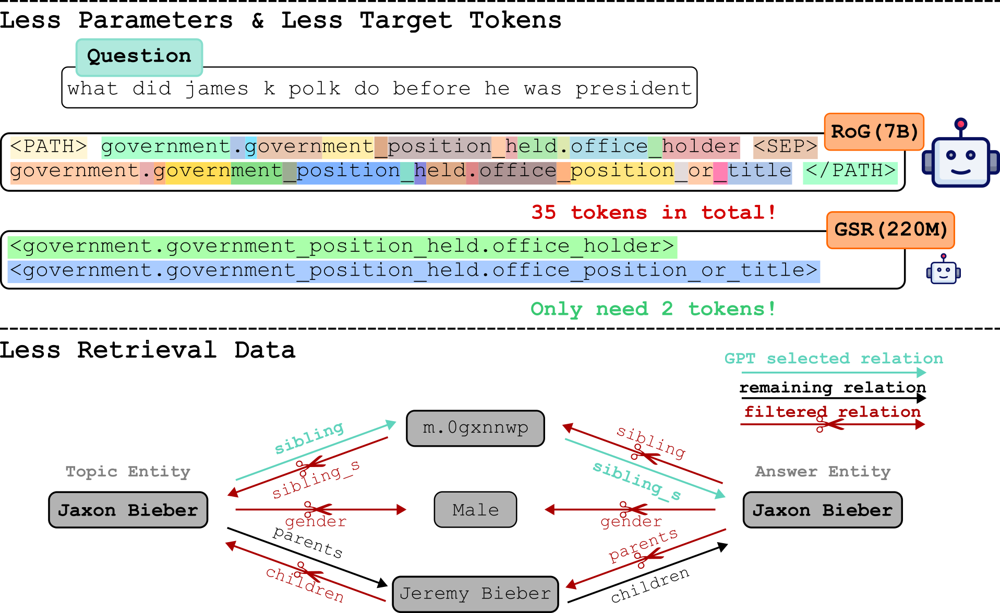

Generative Subgraph Retrieval for Multi-hop KGQA
===

This is the official repository of the paper ["Less is More: Making Smaller Language Models Competent Subgraph Retrievers for Multi-hop KGQA"](https://aclanthology.org/2024.findings-emnlp.927/) by Wenyu Huang, Guancheng Zhou, Hongru Wang, Pavlos Vougiouklis, Mirella Lapata and Jeff Z. Pan.



### Requirements
We highly recommend to use different environment for retriever (GSR) and reader, to prevent potential package imcompatible issues. You can install the required packages for all retriever need by running the following command.
```bash
pip install -r requirements.txt
```

For installing the reader requirements, you can refer to the official [unsloth library](https://github.com/unslothai/unsloth)

### Trained Models
We provide the trained models for both GSR and reader. You can download the models from [here](https://drive.google.com/drive/folders/1HhFunhrkFbiSN5tS3pvw4lUHscvr9gzo?usp=sharing).

### Freebase Setup
In order to obtain the index data, we need to setup Freebase SPARQL service. We follow the instructions provided in [Freebase-Setup](https://github.com/dki-lab/Freebase-Setup) to setup Freebase SPARQL service. Other endpoints should also work, but you might need to adjust the SPARQL query accordingly.

### Data Preparation
Following this part you will be able to reconstruct the index data and the retrieval data for training GSR. If you want to skip this part, simply download the processed data from [here](https://drive.google.com/drive/folders/1HhFunhrkFbiSN5tS3pvw4lUHscvr9gzo?usp=sharing). 

#### Index and Retrieval Data
This part allows you to reconstruct the index data and the retrieval data for training GSR model. You are reqruied to finish the [Freebase setup](#freebase-setup) before running the following commands.

```bash
python preprocess/get_example_examples.py
python preprocess/pseudo_question_generation.py
python preprocess/prepare_gsr_data.py
```

#### Reader Data
After training the GSR model, we can use it to retrieve subgraphs for the reader model. You can use the script to generate both training data and evaluation data, depending on '--set' argument. Before running the script, you need to finish the [subgraph ID prediction](#inference-gsr).

```bash
python preprocess/prepare_reader_data.py \
    --llm <model_id of llm to be finetuned> \
    --set <train/test> \
    --webqsp_predicted_paths <path to the predicted paths of WebQSP dataset> \
    --cwq_predicted_paths <path to the predicted paths of CWQ dataset> \
    --output_dir <output directory>
```

### Training
This part will guide you through the training process of the GSR model and the reader model. Keep all the default settings if you are not sure about the hyperparameters.
#### Training GSR
You can train the GSR model with different training strategies.

**Training with only retrieval data**
```bash
python gsr/pretrain.py \
    --model_id <huggingface model_id, support T5 models> \
    --data_path <data_path to the processed training data> \
    --tokenizer_path <augmented T5 tokenizer path> \
    --output_dir <output directory> \
    --bsz <batch size> \
    --lr <learning rate> \
    --num_epochs <number of epochs> \
    --pretrain_data webqsp cwq
```

**Training jointly**
```bash
python gsr/pretrain.py \
    --model_id <huggingface model_id, support T5 models> \
    --data_path <data_path to the processed training data> \
    --tokenizer_path <augmented T5 tokenizer path> \
    --output_dir <output directory> \
    --bsz <batch size> \
    --lr <learning rate> \
    --num_epochs <number of epochs> \
    --pretrain_data pq webqsp cwq
```

**Pretrain then Finetune**
```bash
python gsr/pretrain.py \
    --model_id <huggingface model_id, support T5 models> \
    --data_path <data_path to the processed training data> \
    --tokenizer_path <augmented T5 tokenizer path> \
    --output_dir <output directory> \
    --bsz <batch size> \
    --lr <learning rate> \
    --num_epochs <number of epochs> \
    --pretrain_data pq

python gsr/finetune.py \
    --model_path <pretrained model path from previous step> \
    --data_path <data_path to the processed training data> \
    --tokenizer_path <augmented T5 tokenizer path> \
    --output_dir <output directory> \
    --bsz <batch size> \
    --lr <learning rate> \
    --num_epochs <number of epochs> \
    --finetune_data webqsp cwq
```

#### Training Reader
After training the GSR model, you can generate the reader training data following the [Data Preparation](#reader-data) part. Then you can train the reader model. We finetune the reader with QLora using the [unsloth library](https://github.com/unslothai/unsloth).
```bash
python train_reader.py \
    --llm <model_id of unsloth supported llm> \
    --max_seq_length <maximum sequence length> \
    --lr <learning rate> \
    --num_epochs <number of epochs> \
    --output_dir <output directory> \
    --train_data <path to the generated training data>
```

### Inference and Evaluation
This part will guide you through the inference process of the GSR model and the reader model.
#### Inference GSR
For generating the subgraph IDs with trained GSR model, you can use the following script.
```bash
python gsr/inference.py \
    --model_path <path to the trained GSR model> \
    --tokenizer_path <augmented T5 tokenizer path> \
    --output_dir <output directory> \
    --nums_beam <number of beams>
```
The above script will generate the subgraph IDs for the test set of WebQSP and CWQ datasets. If you want to generate the subgraph IDs for the training set (mandatory step for generating reader training data), you can add `--train` argument. In addition, the above script will run automatic evaluation for the generated subgraph IDs. If you have the generated subgraph IDs, you can also run the script for evaluation only.
```bash
ptyhon gsr/inference.py \
    --rule_paths <path to the predicted subgraph IDs> \
    --top_m <top m subgraphs ID to be considered> \
    --top_n <top n subgraphs to be evaluated> \
    --eval_only
```
Here `top_m` is the maximum number of subgraph IDs to be considered, and `top_n` is the maximum number of subgraphs to be evaluated. Typically `top_m` >= `top_n` since there exist invalid subgraph IDs.

#### Inference Reader
After generating the subgraph IDs, you can use the following script to generate the predictions of a finetuned reader model.
```bash
python inference_reader.py \
    --model_path <path to the trained reader model> \
    --test_data <webqsp / cwq> \
    --prompt_path <path to the > \
    --max_seq_length <maximum sequence length>
```
The above script will generate the predictions for the given test_data with prompts from prompt_path generated in [previous steps](#reader-data). **Noted that you need to generate the prompt for test data with `preprocess/prepare_reader_data.py` before running this script!!!** The above script also compute the evaluation metrics for the generated predictions.

### Contact
If you have any questions, please feel free to contact Wenyu Huang (w.huang@ed.ac.uk) or Jeff Z. Pan (jeff.z.pan@ed.ac.uk)

### Citation
If you find this repository useful, please cite our paper:
```bibtex
@inproceedings{huang-etal-2024-less,
    title = "Less is More: Making Smaller Language Models Competent Subgraph Retrievers for Multi-hop {KGQA}",
    author = "Huang, Wenyu  and
      Zhou, Guancheng  and
      Wang, Hongru  and
      Vougiouklis, Pavlos  and
      Lapata, Mirella  and
      Pan, Jeff Z.",
    editor = "Al-Onaizan, Yaser  and
      Bansal, Mohit  and
      Chen, Yun-Nung",
    booktitle = "Findings of the Association for Computational Linguistics: EMNLP 2024",
    month = nov,
    year = "2024",
    address = "Miami, Florida, USA",
    publisher = "Association for Computational Linguistics",
    url = "https://aclanthology.org/2024.findings-emnlp.927",
    doi = "10.18653/v1/2024.findings-emnlp.927",
    pages = "15787--15803",
}
```